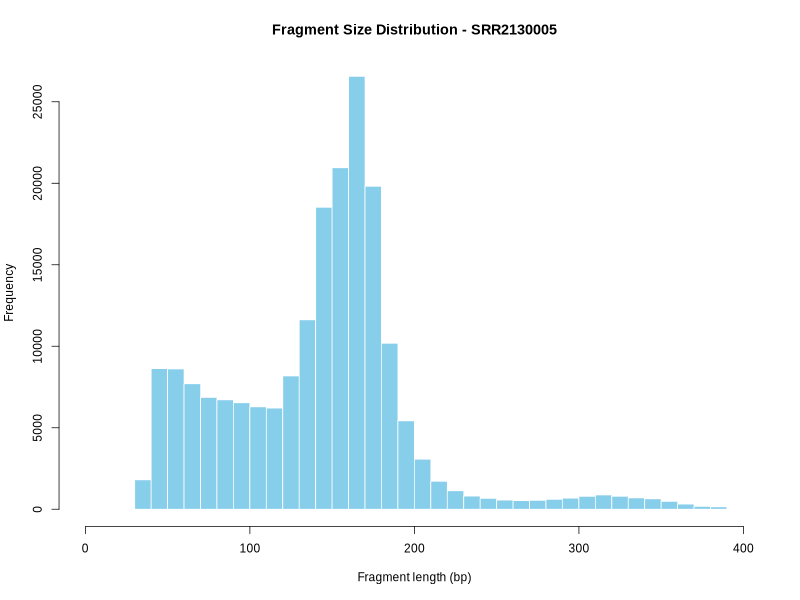
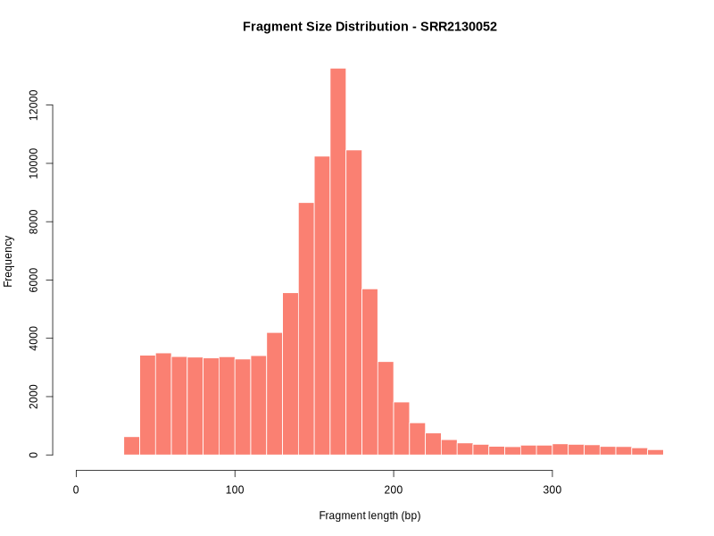
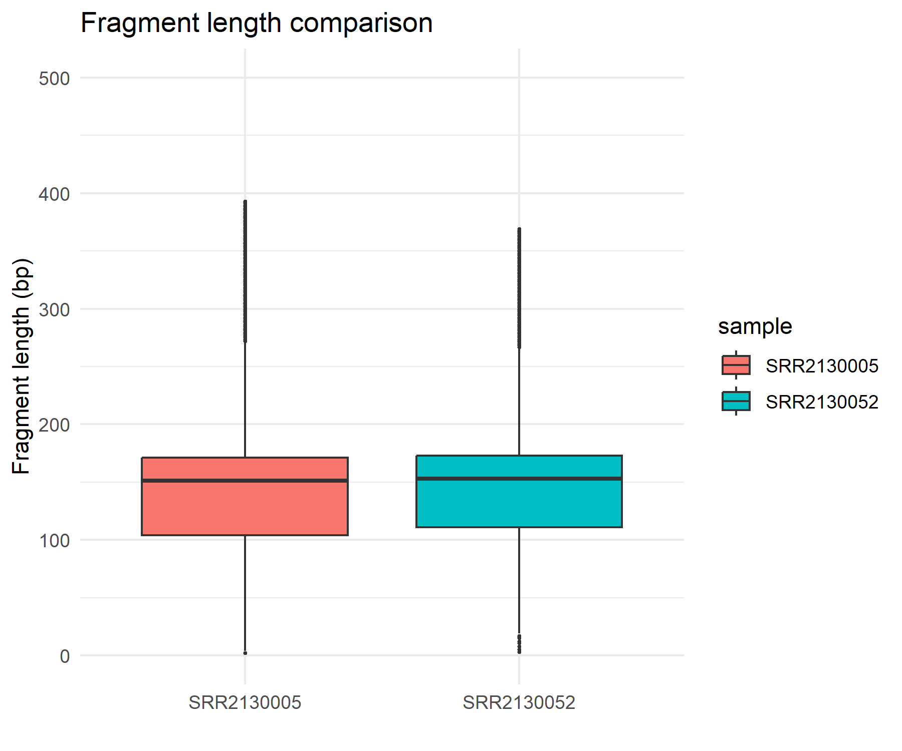

# cfDNA-mini

> **A reproducible educational pipeline for cell-free DNA (cfDNA) fragment-length analysis**
> Portfolio project · Mahdis Saffarhamidi · [LinkedIn](https://linkedin.com/in/mahdis-s-hamidi) · [mahdiisshamidi79@gmail.com](mailto:mahdiisshamidi79@gmail.com)

---

## Overview

Cell-free DNA (cfDNA) circulates in plasma as short nucleosome-protected fragments, typically ~167 bp (mononucleosome) and ~340 bp (dinucleosome). Deviations from these characteristic lengths are studied in liquid biopsy research as potential biomarkers of disease-associated chromatin changes.

This repository demonstrates a **complete, reproducible educational workflow** for cfDNA fragment-length analysis, from paired-end sequencing reads to fragment-length visualisation. The project is intentionally scoped for laptop-based execution by using chromosome 1 only and subsetted reads.

> **Scope disclaimer:** This is a portfolio/learning project, not a publication. Single-chromosome alignment and read subsampling are used for computational feasibility. Results are illustrative and should not be interpreted as clinically or scientifically conclusive.

---

## Samples

| Accession  | BioProject  | Status      | Notes                                                  |
| ---------- | ----------- | ----------- | ------------------------------------------------------ |
| SRR2130005 | PRJNA291561 | ✅ Used      | Healthy donor cfDNA                                    |
| SRR2130052 | PRJNA291561 | ✅ Used      | Healthy donor cfDNA                                    |
| SRR2130040 | PRJNA291561 | ❌ Discarded | Excluded due to low mapping rate on chr1 subset (<40%) |

Raw sequencing data are available from [NCBI SRA](https://www.ncbi.nlm.nih.gov/sra?term=PRJNA291561). Raw FASTQ files are not included in this repository to keep it lightweight.

---

## Pipeline Steps

```text
FASTQ (SRA) → fastp (trimming) → bwa mem (chr1 alignment) → samtools (BAM processing) → R (fragment analysis)
```

---

## 1. Read Trimming — `fastp`

Adapter sequences and low-quality reads are removed. A subset of reads is processed to reduce runtime.

```bash
fastp \
  -i data_raw/${SAMPLE}_1.fastq.gz \
  -I data_raw/${SAMPLE}_2.fastq.gz \
  -o trimmed/${SAMPLE}_1.sub.fastq.gz \
  -O trimmed/${SAMPLE}_2.sub.fastq.gz \
  --reads_to_process 500000 \
  --detect_adapter_for_pe \
  --average_qual 20 \
  --length_required 30 \
  --thread 4 \
  -j trimmed/${SAMPLE}_fastp.json \
  -h trimmed/${SAMPLE}_fastp.html
```

---

### 2. Alignment — `bwa mem`

Reads are aligned against chromosome 1 of hg38.

```bash
bwa mem -t 4 ref/chr1.fa \
  trimmed/${SAMPLE}_1.sub.fastq.gz \
  trimmed/${SAMPLE}_2.sub.fastq.gz \
  > aligned/${SAMPLE}.sam
```

---

### 3. BAM Processing — `samtools`

```bash
samtools view -bS aligned/${SAMPLE}.sam | \
samtools sort -o aligned/${SAMPLE}.sorted.bam

samtools index aligned/${SAMPLE}.sorted.bam
```

---

### 4. QC — `samtools flagstat`

```bash
samtools flagstat aligned/${SAMPLE}.sorted.bam \
  > results/qc/${SAMPLE}.flagstat
```

---

### 5. Fragment Length Extraction

Fragment lengths are extracted from the TLEN field of properly paired reads (`-f 0x2`).

Only positive fragment lengths between 1 and 999 bp are retained:

```bash
samtools view -f 0x2 aligned/${SAMPLE}.sorted.bam \
  | awk '$9 > 0 && $9 < 1000 {print $9}' \
  > results/fragment_lengths/fragment_lengths_${CODE}.txt
```

The output filenames use the final four digits of each SRA accession:

* SRR2130005 → `fragment_lengths_0005.txt`
* SRR2130052 → `fragment_lengths_0052.txt`

Summary statistics and visualisations are generated using:

```bash
Rscript scripts/plot_fragment.R
```

Generated outputs:

```
results/
├── fragment_lengths/
│   └── fragment_summary.csv
└── figures/
    ├── fragment_hist_0005.png
    ├── fragment_hist_0052.png
    └── fragment_boxplot.png
```

---

### 6. Statistical Analysis & Visualisation — R

```bash
Rscript scripts/plot_fragment.R
```

The script generates:

* Per-sample fragment length histograms
* Cross-sample boxplot comparison
* Summary statistics table

See `scripts/plot_fragment.R` for the complete annotated analysis script.

---

## Repository Structure

```
cfDNA-mini/
├── .gitignore
├── LICENSE
├── README.md
├── METHODS.md
├── Snakefile
├── envs/
│   └── environment.yml
├── scripts/
│   └── plot_fragment.R
└── results/
    ├── fragment_lengths/
    │   ├── fragment_lengths_0005.txt
    │   ├── fragment_lengths_0052.txt
    │   └── fragment_summary.csv
    └── figures/
        ├── fragment_hist_0005.png
        ├── fragment_hist_0052.png
        └── fragment_boxplot.png
```

---

## Reproducing the Analysis

### Requirements

* Linux or macOS
* Conda ≥ 23.x
* ~2 GB disk space for reference and intermediate files

### Setup

```bash
git clone https://github.com/mahdis-s-hamidi/cfDNA-mini.git
cd cfDNA-mini

conda env create -f envs/environment.yml
conda activate cfdna-mini
```

---

### Download raw data

```bash
mkdir -p data_raw

fastq-dump --split-files --gzip SRR2130005 -O data_raw/
fastq-dump --split-files --gzip SRR2130052 -O data_raw/
```

---

### Download reference genome

```bash
mkdir -p ref

wget -O ref/chr1.fa.gz \
https://hgdownload.soe.ucsc.edu/goldenPath/hg38/chromosomes/chr1.fa.gz

gunzip ref/chr1.fa.gz

bwa index ref/chr1.fa
```

---

### Run the pipeline

```bash
snakemake --cores 4
```

---

## Key Results

| Sample     | n fragments | Mean (bp) | Median (bp) | SD (bp) |
| ---------- | ----------: | --------: | ----------: | ------: |
| SRR2130005 |     195,889 |     142.8 |         151 |    57.6 |
| SRR2130052 |      97,293 |     145.7 |         153 |    55.3 |

Both samples show fragment-length distributions consistent with expected cfDNA nucleosomal patterns.

Fragment lengths were extracted from chr1-aligned, properly paired reads using the TLEN field. Values represent fragments passing the length filtering step (TLEN 1–999 bp).

The distributions contain a shorter fragment population (<100 bp), which may represent adapter-related or chimeric fragments not fully removed during preprocessing. This represents a known limitation of this educational cfDNA workflow.

---

## Fragment Length Distributions







---

## Biological Interpretation

The median fragment lengths of ~151–153 bp are slightly below the canonical ~167 bp mononucleosomal length. This is consistent with published observations that cfDNA fragments can undergo end trimming during apoptosis, resulting in shorter observed fragment sizes.

The broad distributions and short-fragment tail should be interpreted in the context of this project's limitations, including chromosome 1 restriction and reduced read depth.

---

## Background

cfDNA is released into circulation during apoptosis, where DNA cleavage occurs primarily between nucleosomes. This produces characteristic fragment size patterns:

* ~167 bp: mononucleosome
* ~340 bp: dinucleosome
* ~510 bp: trinucleosome

Alterations in cfDNA fragmentation patterns are actively studied in cancer biology and liquid biopsy research.

### References

* Snyder et al. (2016). *Cell-free DNA comprises an in vivo nucleosome footprint that informs its tissues-of-origin*. Cell, 164(1-2), 57–68.
* Cristiano et al. (2019). *Genome-wide cell-free DNA fragmentation in patients with cancer*. Nature, 570, 385–389.

---

## Limitations

* Only chromosome 1 was used for alignment; genome-wide fragmentation patterns may differ.
* Only 500k reads per sample were processed to allow laptop-based execution.
* This is an educational pipeline and not intended for clinical interpretation.

---

## License

MIT License. See `LICENSE`.

```
```
